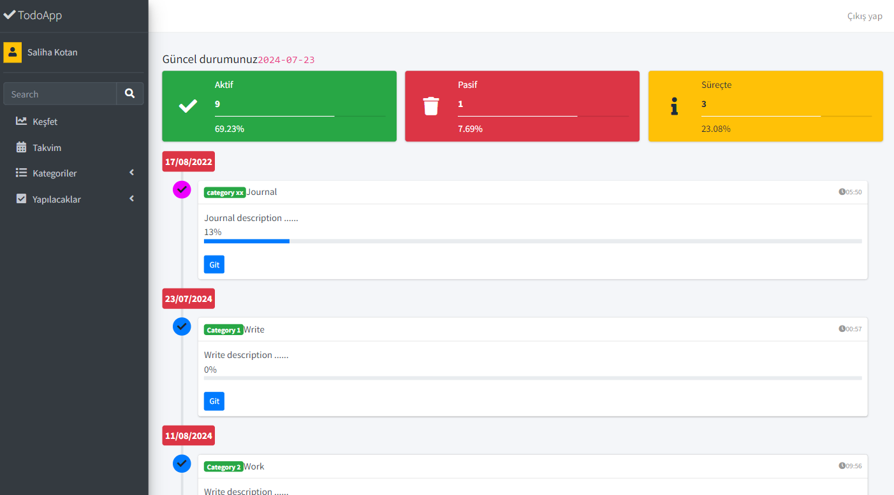
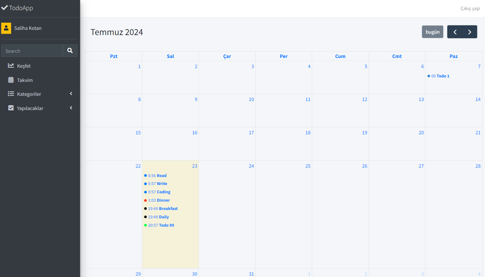
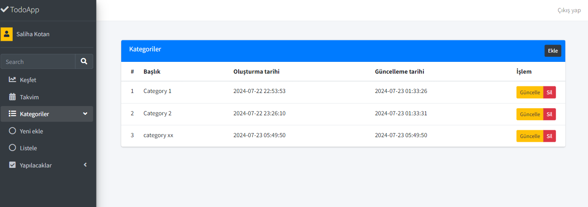
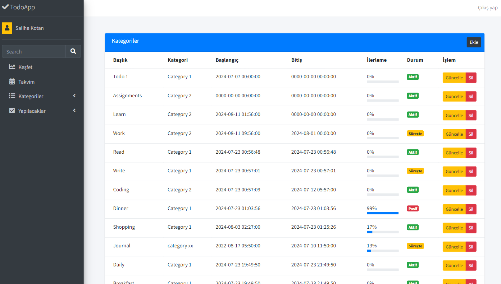
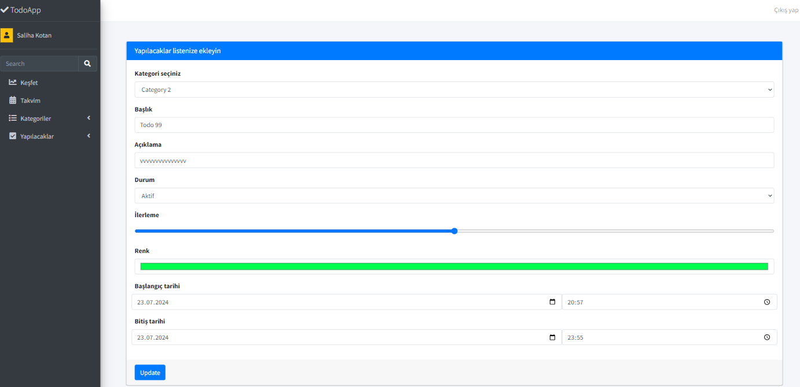
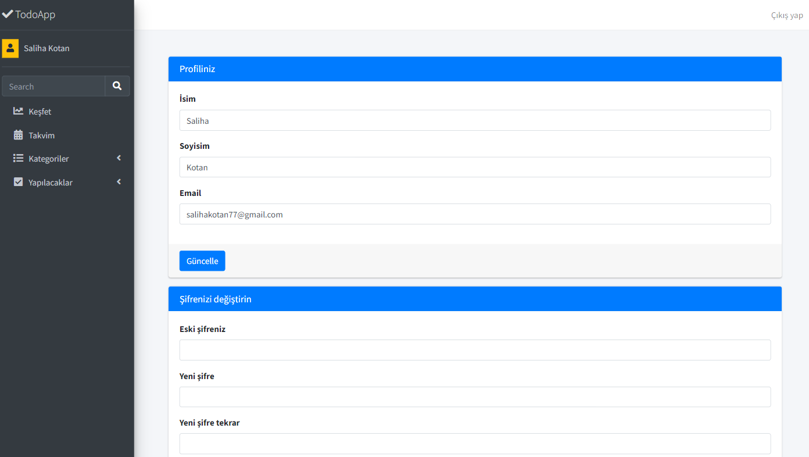

# PHP Todo App :gem:

This project assignment has been prepared for the 'Kodluyoruz' PHP course. It is a sample todo app.

**SQL Tables:** users, todos, categories

---

---

---

---

---

---

